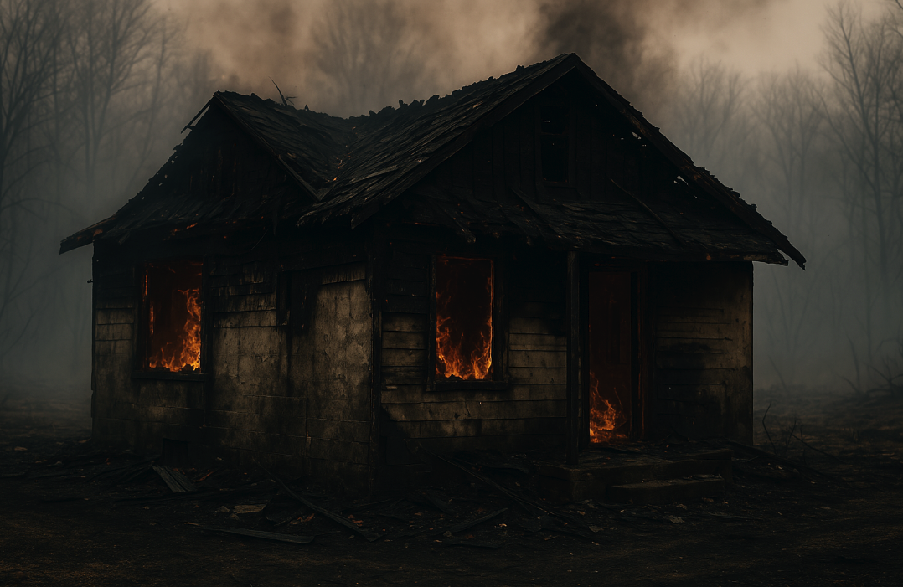
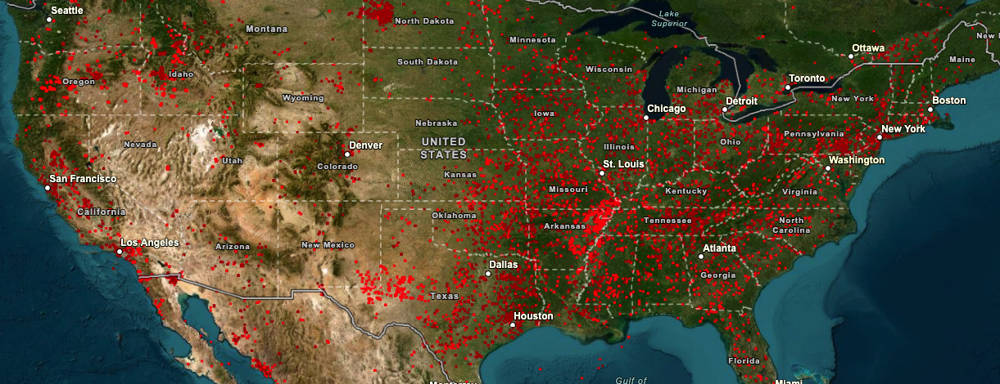
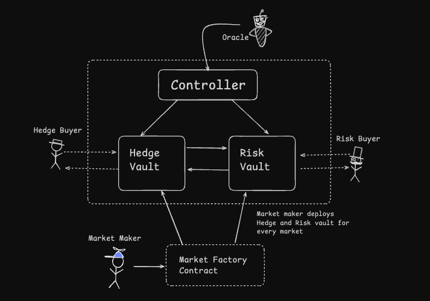

# 🔥 FireBastion

## What We’re Building

We’re building a **decentralized fire insurance** on Soroban to bring **automated payouts, transparency, and fairness** to wildfire prone regions where traditional insurances are failing.

Using trusted oracles for wildfire data from satellites and smart contracts for enforcement, we’re showing how blockchain can turn a slow, opaque process into one that’s **data-driven and instant**. 

>This is a **hackathon MVP**, meant to showcase what’s possible with our flexible insurance framework—not a finished product, but a glimpse of what’s coming.

## Why It Matters

We have family in Northern California, not far from Paradise—where the 2018 wildfire destroyed an entire town. While browsing real estate nearby, we found nearly every property flagged as “Extreme Risk” with **9/10 Fire Factor™** and up to **48% wildfire probability** over 30 years.

Here's a map of all active fires in September 2024 in continental US, during the LA fires. 

Insurers are pulling out, so even if you wanted to pay high premiums, you may not have a choice. Claims, if covered at all, are slow and frustrating. The system is broken across the board.

The recent case of **Luigi Mangione**, who tragically shot a healthcare executive over a denied claim, had nothing to do with fire insurance—but it reflects the **growing anger toward an industry that’s opaque, adversarial, and outdated**. It’s clear: insurance across most verticals needs a reset.

## Our Journey so far, and the future

This project builds on our work from a **Kickstarter grant by the Stellar Foundation (Oct 2024)**. That support helped us launch a flight delay insurance POC—where users are paid automatically if their flight is delayed beyond a set threshold.

Our framework is **modular and extensible**—any team can use it to build insurance products for any vertical, **as long as reliable oracle data exists**. We are building fire insurance in this hackathon to back that claim.

We're applying for the **BUIDL award** with our flight insurance product, where we are **restructuring the framework** to make it more **robust, decentralized and production-ready**, with broader insurance use cases in mind. 

We’re also inviting other builders to build on top of our framework and disrupt the rest of the insurance industry.

## 🔥 Fire Insurance Architecture — ZkTLS and TEE Oracles

To showcase the flexibility of our decentralized insurance framework, we built a wildfire insurance MVP that pays out homeowners automatically when their property is detected to be within a wildfire zone.

### 🏡 Homeowner Onboarding

- Homeowners provide their **home address** and prove **residency** using the [Reclaim Protocol](https://reclaimprotocol.org/) with a ZK proof (e.g., Amazon order address or Uber usage within the last 6 months).
- The address is converted to **latitude and longitude** using a **geocoding API**.

### 🛰️ Fire Detection via Acurast

- The system queries the **NASA FIRMS (Fire Information for Resource Management System) API**, which provides near real-time **satellite-based fire data**.
- A **Node.js script** runs inside an **Acurast Trusted Execution Environment (TEE)** and receives:
  - The coordinates of the homeowner's property.
  - FIRMS satellite fire incident data.
- The script determines if the property is within or near an active fire zone.
- This computation happens inside a TEE to ensure trust and prevent tampering.

This MVP is a real-world example of how our framework supports **on-chain parametric insurance**—powered by trusted oracles, automated execution, and secure data validation. 

> 📦 This system enables the creation of scalable, transparent, and automated insurance products across multiple verticals—*as long as reliable oracle data is available*.

## 🧠 Soroban Smart Contracts - The Insurance Framework

Our insurance framework is built around a **modular vault system**, inspired by the **ERC-4626 tokenized vault standard** and tailored for **Soroban smart contracts**.

At the core, each insurance market (e.g., wildfire, flight delay) is powered by two vaults:

- **Hedge Vault** – Receives premiums from users seeking protection (hedge buyers). They are eligible for payouts when a covered event occurs.
- **Risk Vault** – Funded by counterparty investors (risk buyers) who take on the event risk in exchange for yield.

Vaults are deployed and managed using two key contracts:

- **Market Factory Contract**
  - Deploys new pairs of Hedge and Risk Vaults for each insurance market.
  - Enables permissionless creation of custom insurance markets (e.g., wildfire, flood, flight delay).
  - Links each market to its associated controller and oracle feed.

- **Controller Contract**
  - Manages the flow of capital between Hedge and Risk Vaults.
  - Triggers payouts based on verified claim events from oracles.
  - Handles maturity logic, liquidity constraints, and vault state transitions.
  - Ensures all logic is transparent and deterministic.

When a claim condition is met (e.g., fire detected at the insured location), an **Oracle** sends real-world event data to the controller. If validated, the Soroban contract **automatically executes a payout** from the Hedge Vault to the claimant. Funds may be rebalanced between vaults according to predefined rules.